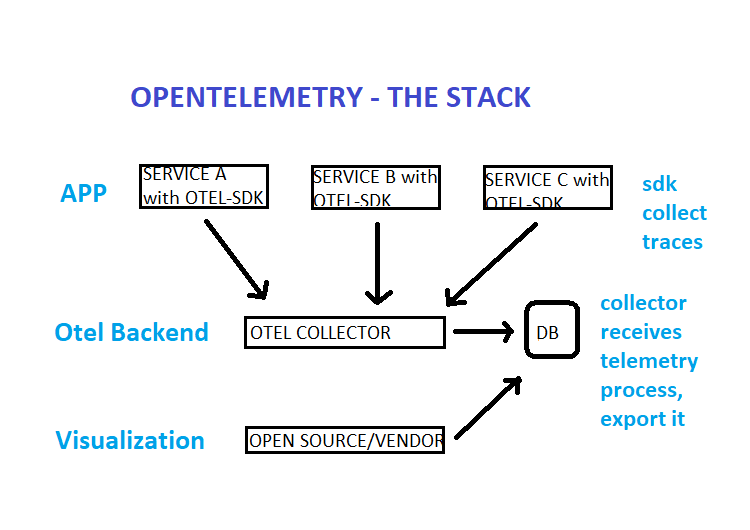
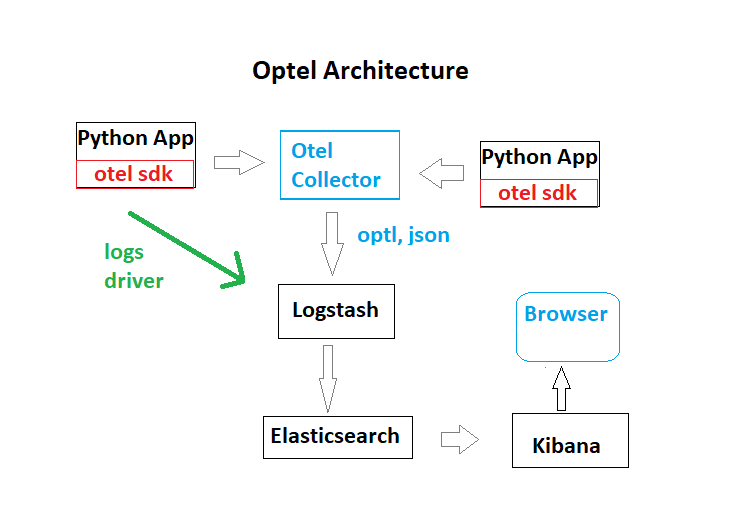

# Solution of TechnicalTest
Implement a local distributed system with OpenTelemetry for log collection, Logstash for log processing, and an ELK stack for visualization and storage.

# Architecture Decisions
Use dockercompose to run all the microservices, more feasible in the time span, easy to troubleshoot and almost easy to apply any modifications required. For the enironment there was defined a speficif network: otel with bridge driver in order to connect to host network, and some local volumes and docker volumes were defined in order to maintain states and required configuration files.
Create some  in python and implement the opentelemetry parameters manually and automatically into the microservices following guidelines: https://opentelemetry.io/docs/instrumentation/python/
This in order to unerstand how the process works, so i will be able later on to implement for others microservices. 
See for explanation steps: rolldice/instructions.md
Regards the implementation of Opentelemetry i decided to use opentelemetry collector in the gateway model, this because of simplicity, standalone server, central to receive logs from different microservices and not overload each microservice with a sidecar optl agent.

# Opentelemetry Contextual Concepts
Opentelemetry provides a standard for instrumentation that is independent of the tools, where logs, metrics and traces are collected. One specification,implementation for every programming language, basically has two components:the OpenTelemetry API (which defines how OpenTelemetry is used) and language SDKs (which define the specific implementation of the API for a language) that allows the generatin of observability data.



Telemetry: Compromises the instrumentation ( code ability to emit logs, metrics and traces): 
- Logs: The application history. Logs can point to a trace
- Traces: The context of why things are happening (trace events). Traces can have logs inside it.
- Metrics: Numbers telling statical faiths about the system. Metrics can be correlated via time to both

Among the three observability data types supported by OpenTelemetry (metrics, traces, and logs) traces are especially useful for understanding the behavior of distributed systems. OpenTelemetry tracing allows developers to create spans, representing a timed code block. Each span includes key-value pairs—called attributes—to help describe what the span represents, links to other spans, and events that denote timestamps within the span. By visualizing and querying the spans, developers gain a complete overview of their systems, helping them identify problems quickly when they arise.

For more info, check: https://opentelemetry.io/docs/what-is-opentelemetry/

# Connectivity diagram


* Otel Sdk: Instrumetantion specific for each programming language, permits define and collect traces
* Otel Collector: Receive telemetry, process it, and exports it to the desired backend (in this case ELK)
* Logstash: Pipeline tool that accepts input logs from various sources and export data to different targets.
* Elasticsearch: Nosql database based in lucence search which allows the storade of input/logs
* kibana: Visualization UI layer, that helps to monitor applications logs

# Problems
Connection between opentelemetry collector and logstash
***Reviewed options***
- Collect logs from standar docker containers logs which are in json format by default and then inject them in elasticsearch
  The idea is basically start the application services with logging driver standard, so they are writting in json format their logs. See: ./elk/logstash/drivers/instructions.md
- Collect logs from gelf server, which handles a compatible format with logstash, the strategy is to start the application     
  containers with log driver option to output their logs to gelf server. See: ./elk/logstash/drivers/instructions.md
- Collect logs forwarded to syslog by containers and then converts them with some filters and grok, i didn't have enough time 
  to test it. See: ./elk/logstash/drivers/instructions.md
- Build a custom collector: too complex for the time and not enough knowledge to do it
  more info in: https://opentelemetry.io/docs/collector/custom-collector/
- There exist a connection from optl collector directly to Elasticsearch but do not uses logstash, so it would not comply   
  with the exercise requirements. more info in: https://www.elastic.co/guide/en/apm/guide/current/open-telemetry-direct.html#connect-open-telemetry-collector

# Prerequisites
- Docker
- Docker Compose v2.0.0+
- 4 GB of RAM for the application

# Guide to run the Environment
At the main directory: lekl, execute the following steps:
```
docker compose -f dockercompose.otel.yaml
```
After some minutes you would have the environment up and running, then you can visit one of the applications:
http://localhost:8081
Reload some times this url in order to generate some logs, metrics and traces:
http://localhost:8081/rolldice

After some time you can go to kibana and review the logs were populated by logstash by elasticsearch
!!! Work in progress, not yet functioning

# Trying right now
Define an export from collector using otlhttpexporter and setup the endpoint as logstash server http port 5000
related documentation over: https://github.com/open-telemetry/opentelemetry-collector/tree/main/exporter/otlphttpexporter
```
exporters:
  otlphttp:
    endpoint: https://logstash:5000
```
